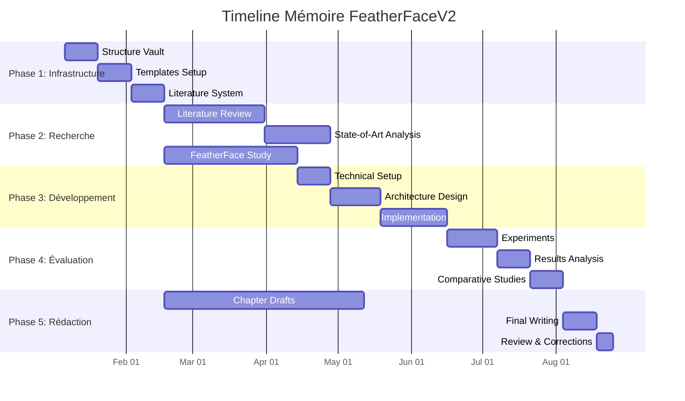

# 📅 Project Timeline - Planning et Milestones FeatherFaceV2

> Timeline détaillé du projet de mémoire avec milestones critiques, deadlines académiques et coordination technique

---

## 🎯 Vue d'ensemble temporelle

**Durée totale :** 20 semaines (5 mois)  
**Début :** Semaine 1 (Juin 2025)  
**Soutenance :** Semaine 20 (Octobre 2025)  
**Statut actuel :** 🚀 Semaine 1 - Phase Structure Fondamentale

---

## 📊 Phases principales du projet

---

## 📋 PHASE 1 : INFRASTRUCTURE (Semaines 1-2)

### 🗓️ Semaine 1 (11-17 Juin 2025)
**Objectif :** Setup infrastructure recherche et technique

#### 📚 Infrastructure Académique
- [x] ✅ **Vault Obsidian structure** → [[00-Index/Thesis Hub|Thesis Hub]]
- [x] ✅ **Arborescence complète** → 35+ dossiers organisés
- [x] ✅ **Navigation système** → [[00-Index/Chapter Navigation|Chapter Navigation]]
- [ ] 🔄 **Templates essentiels** → [[Templates/README|Templates]]
- [ ] 🔄 **Workflow literature** → [[Literature/README|Literature Management]]

#### 💻 Infrastructure Technique  
- [ ] 🔄 **FeatherFace fork setup** → [[Technical-Notes/FeatherFace-Fork/Development-Setup|Setup]]
- [ ] 🔄 **Environment configuration** → PyTorch, CUDA, datasets
- [ ] 🔄 **Jupyter integration** → [[Technical-Notes/Jupyter-Workflows/README|Workflows]]
- [ ] 🔄 **Dataset preparation** → [[Technical-Notes/Dataset-Management/README|Datasets]]

#### 🎯 Milestone Semaine 1
- **Critère réussite :** Infrastructure opérationnelle, premier workflow testé
- **Livrables :** Vault fonctionnel, FeatherFace buildable, templates utilisables

---

## 🚨 Deadlines critiques

| Date | Deadline | Type | Statut |
|------|----------|------|--------|
| **24 Juin** | Infrastructure complète | ✅ Setup | 🔄 En cours |
| **8 Juillet** | Literature foundations | 📚 Research | ⏳ Planifié |
| **5 Août** | Literature review complète | 📚 Research | ⏳ Planifié |
| **19 Août** | Methodology finalized | 🔬 Method | ⏳ Planifié |
| **16 Septembre** | Implementation complète | 💻 Code | ⏳ Planifié |
| **7 Octobre** | Results analysis | 📊 Results | ⏳ Planifié |
| **21 Octobre** | Final thesis draft | 📝 Writing | ⏳ Planifié |
| **28 Octobre** | **SOUTENANCE** | 🎓 Defense | ⏳ Final |

---

## 🎯 Milestones de validation

### 🏁 Milestone 1 : Infrastructure (Fin Semaine 2)
- [x] ✅ Vault structure opérationnelle
- [ ] 🔄 Templates validés sur cas réels  
- [ ] 🔄 FeatherFace baseline reproduced
- [ ] 🔄 Workflows optimisés

### 🏁 Milestone 2 : Literature Foundation (Fin Semaine 8)
- [ ] 📚 50+ papers analysés et intégrés
- [ ] 🔗 Theoretical framework établi
- [ ] 📋 Methodology foundations solides
- [ ] 🎯 Research gaps identifiés

### 🏁 Milestone 3 : Implementation Ready (Fin Semaine 16)  
- [ ] 💻 FeatherFaceV2 implementation complète
- [ ] ⚡ Performance optimization validée
- [ ] 🧪 Evaluation pipeline opérationnelle
- [ ] 📊 Preliminary results promising

### 🏁 Milestone 4 : Research Complete (Fin Semaine 19)
- [ ] 📈 Comprehensive evaluation terminée
- [ ] 🎯 Research contributions validées
- [ ] 📝 All chapters drafted
- [ ] 🔬 Scientific rigor achieved

### 🏁 Milestone 5 : Thesis Ready (Fin Semaine 20)
- [ ] 📋 Final thesis compiled
- [ ] 🎓 Defense presentation ready
- [ ] 💻 Code repository published
- [ ] 🚀 Research reproducible

---

*Timeline v1.0 | Phase Actuelle: Infrastructure | Progression: 15% | Prochaine échéance: 24 Juin - Infrastructure Complète*